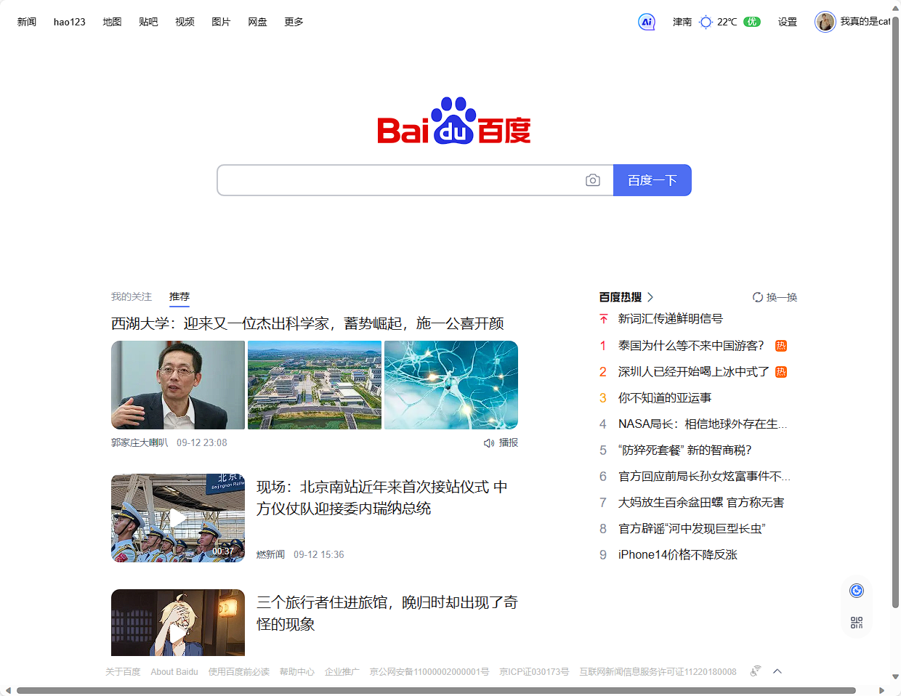
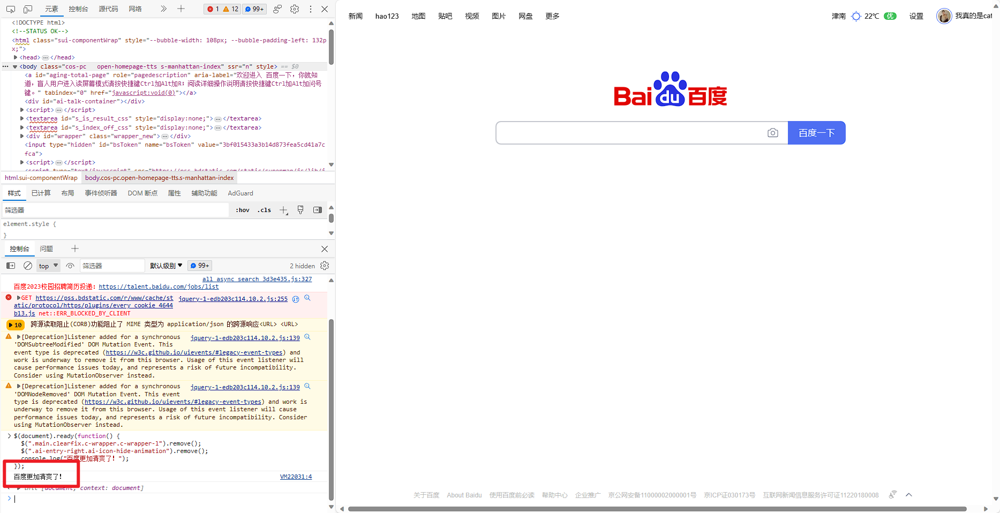

# 第一次个人作业 Web 前端初探

## 任务要求

1. 针对任意网页，调研其不同方式请求，
至少包括get、post请求，写出或截图其请求及相应数据包
2. 针对任意网页，使用Jquery，能够出发某一事件， 
写出至少三条语句，截图响应前后不同的状态
3. 完成一个浏览器插件，功能不限，文档中写明功能及代码


## 任务实现

### 网页请求调研

调研网页：[哔哩哔哩 (゜-゜)つロ 干杯~-bilibili](WWW.BILIBILI.COM)

- GET 请求

  - 获取单个稿件数据（如转赞评、收藏、分享等）
  - 请求 URL：

    > https://member.bilibili.com/arcopen/fn/data/arc/stat

  - url 参数：

    > client_id （申请应用时获得的 client_id）
    >
    > access_token （通过 OAuth2 授权获取到的 access_token）
    >
    > resource_id （稿件唯一 ID）

  - 相应参数：

    > title 标题
    >
    > ptime 发布时间
    >
    > view 播放数
    >
    > danmaku 弹幕数
    >
    > reply 评论数
    >
    > favorite 收藏数
    >
    > coin 投币数
    >
    > share 分享数
    >
    > like 点赞数

  - 相应案例：
    ```
    {
        "code": 0,
        "message": "0",
        "ttl": 1,
        "data": {
            "view":198,
            "danmaku":166,
            "reply":11,
            "favorite":36,
            "coin":8,
            "share":79,
            "like":135
        }
    }
    ```

- POST 请求
  - 视频稿件提交
  - 请求参数

    - 请求 URL

  
    > https://member.bilibili.com/arcopen/fn/archive/add-by-utoken
  
    - 请求url 参数
  
  
     |    参数名    | 必传 |  类型  |                   备注                   |
     | :----------: | :--: | :----: | :--------------------------------------: |
     |  client_id   | true | string |        申请应用时获得的client_id         |
     | access_token | true | string |    通过OAuth2授权获取到的access_token    |
     | upload_token | true | string | 通过文件上传预处理(upload_token)授权获取 |
  
    - body参数
  
  
     |   参数名   | 必传  |  类型  |                      备注                       |
    | :--------: | :---: | :----: | :---------------------------------------------: |
     |   title    | true  | string |   稿件标题，长度小于80，短时间内标题不能相同    |
    |   cover    | false | string |        封面地址，必须由上传封面接口得到         |
     |    tid     | true  |  int   |         分区id，由获取分区信息接口得到          |
    | no_reprint | false |  int   |      是否允许转载 0-允许，1-不允许。默认0       |
     |    desc    | false | string |              视频描述，长度小于250              |
    |    tag     | true  | string | 视频标签，多个标签用英文逗号分隔，总长度小于200 |
     | copyright  | true  |  int   |        1-原创，2-转载(转载时source必填)         |
    |   source   | false | string |    如果copyright为转载，则此字段表示转载来源    |
  
    - 请求案例

  
    ```
    {
            "mid": 20124,
            "title": "openplat测试稿件1",
            "cover": "http://ua.hdslb.com/bfs/archive/ba65af14b78cb7f92194887b1e6a77422dddf43c.png",
            "tid": 21,
            "tag": "clientDome",
            "desc": "test",
            "copyright": 1,
            "no_reprint": 0
    }
    ```
  
  - 响应参数
  
    - body参数
  
      |   参数名    |  类型  |    备注    |
      | :---------: | :----: | :--------: |
      | resource_id | string | 稿件唯一ID |
  
    - 相应案例
    
    ```
    {
            "code": 0,
            "message": "0",
            "ttl": 1,
            "data": {
                    "resource_id":"BV17B4y1s7R1"
            }
    }
    ```


### 针对网页编写Jquery触发事件

选择网页：[百度一下](WWW.BAIDU.COM)

```javascript
$(document).ready(function() {
  $(".main.clearfix.c-wrapper.c-wrapper-l").remove();
  $(".ai-entry-right.ai-icon-hide-animation").remove();
  console.log("百度更加清爽了！");
});
```

**使用前**



**使用后**




### 完成一个浏览器插件

插件名称：百度去广告

插件用途：用于去除百度页面上一些讨厌的广告

插件代码：

```javascript
// ==UserScript==
// @name         百度去广告
// @namespace    http://tampermonkey.net/
// @version      0.1
// @description  帮你去除烦人的广告，还你一个清爽的搜索体验
// @author       2110951梁晓储
// @match        https://www.baidu.com/*
// @icon         https://www.google.com/s2/favicons?sz=64&domain=baidu.com
// @license      AGPL -3.0
// @grant        none
// ==/UserScript==

(function () {
    'use strict';

    // 要去除的元素的XPath列表
    var xpaths = [
        '//*[@id="s-hotsearch-wrapper"]',
        '//*[@id="u1"]/div[1]',
        '//*[@id="s_side_wrapper"]',
        '//*[@id="content_right"]',
        '//*[@id="top-ad"]',
        '//*[@id="con-ar"]',
        '//*[@id="s_wrap"]',

    ];

    function manipulateElements() {
        // 隐藏指定XPath的元素
        function hideElements() {
            for (var i = 0; i < xpaths.length; i++) {
                var elements = document.evaluate(xpaths[i], document, null, XPathResult.UNORDERED_NODE_SNAPSHOT_TYPE, null);
                for (var j = 0; j < elements.snapshotLength; j++) {
                    var element = elements.snapshotItem(j);
                    element.style.display = 'none';
                }
            }
        }

        // 移除指定XPath的元素
        function removeElements() {
            for (var i = 0; i < xpaths.length; i++) {
                var elements = document.evaluate(xpaths[i], document, null, XPathResult.UNORDERED_NODE_SNAPSHOT_TYPE, null);
                for (var j = 0; j < elements.snapshotLength; j++) {
                    var element = elements.snapshotItem(j);
                    element.parentNode.removeChild(element);
                }
            }
        }

        // 在页面加载完成前执行隐藏元素操作
        hideElements();

        // 在页面加载完成后执行移除元素操作
        window.addEventListener('load', function () {
            removeElements();
        });
        
        //为保证去除彻底，运用了两种方法同时去除
    }

    manipulateElements();
})();

```

